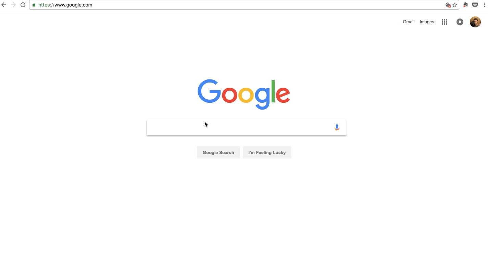

# Typist

> Chrome extension for faster browser use, especially with complex web apps.

## Premise
Stop clicking on things! Use Vim-style shortcuts to find and select inputs or links on webpages in Chrome.

### Philosophy
Typist is half type-ahead-find, half Vim/Tmux emulator. It is my attempt to add the most useful and intuitive Vim bindings to Chrome, and to do so in a way that doesn't overlap or conflict with existing shortcuts.

### Goals
- Bring the speed and comfort of Vim search to Chrome
- Fill out web forms without using a mouse
- Stop using Cmd+F to find fields buried on the page

## Installation

[Install Typist](https://chrome.google.com/webstore/detail/chrome-typist/madafhibjmdfbgngbimfegjdlddkefle) from the Chrome Web Store.

## Use
If you use Vim or Tmux, the keyboard shortcuts for Typist will feel familiar to you.

### Modes
Typist has three modes: Inactive, Regex, and Browse.

#### Inactive
When the Typist cmdline is not visible, Typist is in Inactive mode. Press **Ctrl+F** (or the shortcut you defined on your extensions page) to bring up the Typist cmdline and start issuing commands.

- Press **Ctrl+C** (or the shortcut you defined on your extensions page) to blur `document.activeElement`; for example, to exit from a text input you are typing in.

#### Regex
Typist is in Regex mode when you are typing into the cmdline `/` prompt. The text you enter into the prompt will be fed as a regular expression to a script that searches the current page for matches. Matches, as long as there are fewer than the maximum number, will be highlighted in yellow.

Typist is searching for node matches, not just text matches. So if you type "c.\*k" in Regex mode your query will match a link whose text is "Click here," and the entire link will be highlighted. The assumption is that you want to manipulate the link, and not just the matching text within it.

- Press **Ctrl+P** in Regex mode to issue the "Back" command and go back in the browser history. Press **Ctrl+N** in Regex mode to issue the "Forward" command and go forward in the browser history.

- Press **Enter** to go into Browse mode and higlight the first match on the page. Press **Shift+Enter** to go into Browse mode and highlight the last match on the page.

- Press **Ctrl+C** to go into Inactive mode at any time.

#### Browse
Typist goes into browse mode when you hit enter in Regex mode. The cmdline will stay active but your input will not be recorded as text. Instead, you can issue commands by pressing any of the follow keys.

- **N** issues the "Browse next" command, which highlights the next match on the page.

- **Shift+N** issues the "Browse previous" command, which highlights the previous match on the page.

- **Enter** issues the "Select" command to the currently highlighted node. Selecting a node will do different things based on what type of node it is. Selecting will click on links, labels, and other elements and select the text inside text inputs.

- **Cmd+Enter** issues the "Open" command to the currently highlighted node. Only links (`<a>` tags) will respond to this command. They will open in a new tab.

- **Shift+Enter** issues the "Soft select" command to the currently highlighted node and focus that node.

- **Y** issues the "Yank" command to the currently highlighted node. Yanking a node copies its text, or, in the case of text inputs, its current value, to the clipboard.

- Press **Ctrl+C** to go into Inactive mode or **Ctrl+F** to go into Regex mode at any time.

### Options
Typist takes options for six display values: background color, border color, font, text color, informational text color, and warning color. The string value of these options will be applied to Typist's components' CSS unparsed, so you can use named colors or hex values, and you can set the font to one installed on your machine.

The final option, max matches, determines how many matches Typist will process at once on the page. Setting this value to a very high number may break some pages on generic RegEx searches like `.`. If the number of matches for the current query is above the max number, Typist will neither highlight nor focus on them, and the cmdline will show the number in red (or the warning color from the options). The default is 50.

## Development

### Local development
Typist is built with ES6, React, Webpack, and ESLint.

To load a local copy of Typist into Chrome:

1. Clone this repo.
2. Run `npm install && npm run build`.
3. Go to chrome://extensions and enable developer mode.
4. Click "Load unpacked extension" and select the chrome-typist directory.

To watch the repo for changes, rebuilding the extension on every revision, run `npm install && npm run watch`. For these changes to be reflected in Chrome, you will have to reload the extension at chrome://extensions.

If you are interested in contributing to Typist, send me a message!

### Feature wishlist
- [ ] Close unpinned tabs
- [ ] Scrolling
- [ ] Query selector mode
- [ ] Inspect command
- [ ] Open cmdline in new window
- [ ] Fuzzy tab search

## Shoutout
Two Chrome extensions for keyboard geeks I use every day are Fast Tab Switcher ([Chrome Store](https://chrome.google.com/webstore/detail/fast-tab-switcher/jkhfenkikopkkpboaipgllclaaehgpjf) | [Github](https://github.com/BinaryMuse/chrome-fast-tab-switcher)), by Michelle Tilley, and Tab Pinner ([Chrome store](https://chrome.google.com/webstore/detail/tab-pinner-keyboard-short/mbcjcnomlakhkechnbhmfjhnnllpbmlh)), by Brandon Buck.
